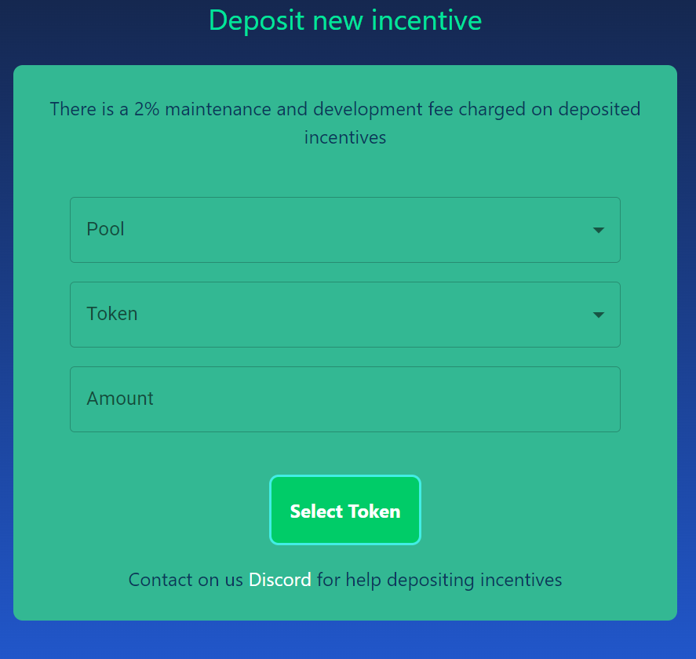

# Buyer Manual

Please read the disclaimer before depositing an incentive: [Disclaimers](../faq/disclaimers.md)

The Active Proposal Card:

The arrows on top let you cycle through active proposals if there is more than one active on the Beethoven-X Snapshot space. **Time Remaining** displays the time to the voting & incentivization deadline. Incentivizing Your Pool Underneath the card you will find the Deposit Accordion. Depositing an incentive is simple:

1. Select the pool you wish voters to vote for.
2. Select the token you would like to pay with.
3. Enter your desired amount.
4. Deposit the incentive (You will be prompted to approve the ERC20 if you haven't yet).

If you would like to incentivize with a token that isn't listed on the site, please contact the VoteHoven team via [Discord](https://discord.com/invite/DKQ7xjwgNr) or [Twitter](https://twitter.com/votehoven)
