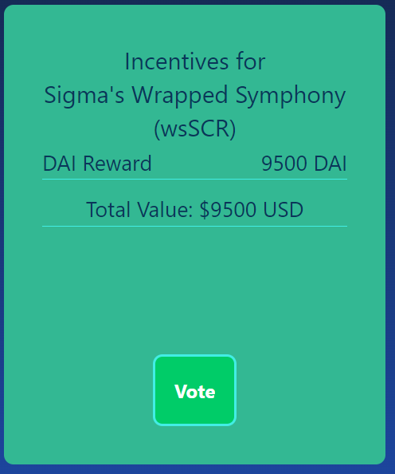

# Voter Manual

This is the VoteHoven dashboard:

The dashboard will house all of your possible actions as a voter. Make sure you connect your wallet with the **Connect** button on the top right, and connect to the Fantom Opera network to start using VoteHoven.

### **VOTING**

To be eligible for a reward, you vote for the indicated pool on the Beethoven-X Snapshot space. Soon you will be able delegate your **fBEETS** to VoteHoven, and we will do the voting for you to maximize your rewards!

To vote manually, check out the incentives, choose the one you would like to receive and vote for it on Snapshot. You don't have to vote 100% of your weight for the incentivized pool. The share of the incentive you receive will be relative to the % of the voting power you allocated to the pool (You could choose to receive a share of different incentives this way for example).

For example, here is illustrated a $DAI incentive of 9,500 $DAI. To receive a share of the incentive you will have to vote for Sigma's Wrapped Symphony on the Beethoven-X Snapshot proposal. You can click on the button on the bottom of the card to take you to the Beethoven-X Snapshot space.

### CLAIMING REWARDS

To claim your rewards, press the **Claim Rewards** button, and you will arrive at the claim page. The rewards are distributed via a claim button \~24h-48h after the end of the proposal.
